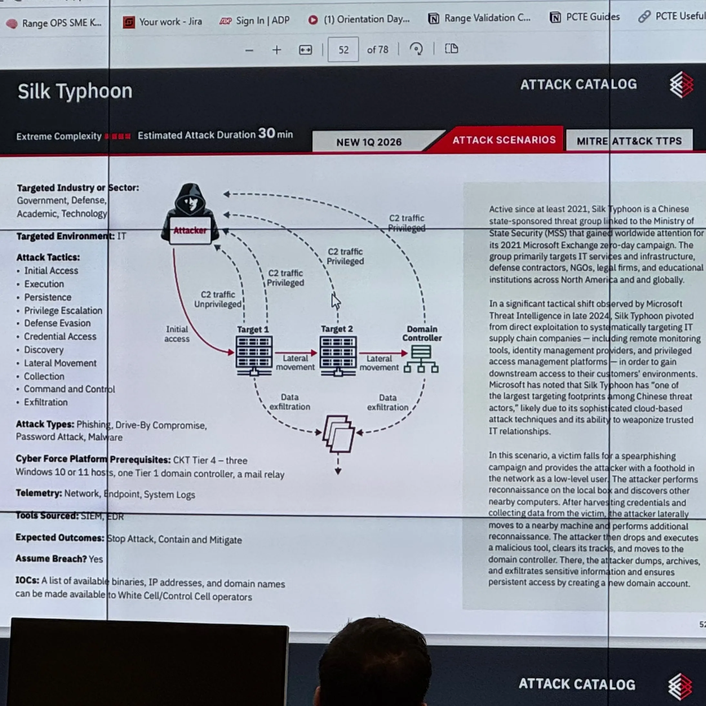

Incident Response Case Study – Exchange Compromise Investigation

After three days of training to build and operate SimSpace, the platform we will use for future cyber training and for creating labs for CCDC, our team participated in a live incident response exercise on April 2nd, 2026.

The event schedule included a 9:00 AM - 10:30 AM LiveFire Exercise and a 1:00 PM - 2:30 PM LiveFire Review Session. During the exercise, our team successfully identified every attack item in the scenario. The investigation went well, and our team finished as the winning team.

Investigated multi-stage intrusion involving brute force, credential dumping (Mimikatz), lateral movement, and email exfiltration.
Analyzed Windows Event Logs, PowerShell logs, and Security Onion data.
Reconstructed attacker timeline and mapped techniques to MITRE ATT&CK.
Identified indicators of compromise and root cause.

